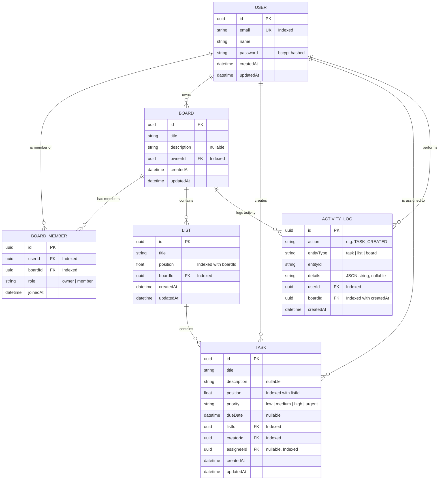

# Database Schema Design

## Entity Relationship Diagram



---

## Table Details

### User
- Primary entity for authentication
- `email` has a unique constraint and index for fast login lookups
- `password` is hashed with bcrypt (12 salt rounds)
- Relations: owns boards, member of boards, creates tasks, gets assigned tasks

### Board
- Top-level organizational entity
- `ownerId` links to the board creator (cascade delete)
- Contains lists, members, and activity logs

### BoardMember
- Junction table for many-to-many User ↔ Board relationship
- Composite unique constraint on `(userId, boardId)` prevents duplicate membership
- `role` field supports `"owner"` and `"member"` roles
- Separate indexes on `boardId` and `userId` for fast lookups in both directions

### List
- Belongs to a single Board (cascade delete)
- `position` uses **float-based ordering** to avoid reindexing all items on reorder
- Composite index on `(boardId, position)` for sorted retrieval

### Task
- Belongs to a single List (cascade delete when list is deleted)
- `position` uses float-based ordering (same strategy as Lists)
- `priority` enum: `low`, `medium`, `high`, `urgent`
- `assigneeId` is nullable (unassigned tasks) with `onDelete: SetNull`
- `creatorId` tracks who created the task
- Multiple indexes for efficient querying by list, assignee, and creator

### ActivityLog
- Append-only audit trail for all board actions
- `action` field uses enum-like strings: `TASK_CREATED`, `TASK_UPDATED`, `TASK_MOVED`, `TASK_DELETED`, `TASK_ASSIGNED`, `LIST_CREATED`, `LIST_UPDATED`, `LIST_DELETED`, `BOARD_UPDATED`, `MEMBER_ADDED`, `MEMBER_REMOVED`
- `details` stores JSON string with context (e.g., task title, member name)
- Composite index on `(boardId, createdAt)` for efficient paginated queries

---

## Indexing Strategy

| Table | Index | Purpose |
|-------|-------|---------|
| User | `email` | Login lookup, uniqueness |
| Board | `ownerId` | Find boards owned by user |
| BoardMember | `boardId` | List members of a board |
| BoardMember | `userId` | Find boards a user belongs to |
| BoardMember | `(userId, boardId)` | Unique constraint |
| List | `boardId` | Fetch lists for a board |
| List | `(boardId, position)` | Sorted list retrieval |
| Task | `listId` | Fetch tasks for a list |
| Task | `(listId, position)` | Sorted task retrieval |
| Task | `assigneeId` | Find tasks assigned to user |
| Task | `creatorId` | Find tasks created by user |
| ActivityLog | `boardId` | Fetch activity for board |
| ActivityLog | `(boardId, createdAt)` | Paginated activity (newest first) |
| ActivityLog | `userId` | Fetch activity by user |

---

## Design Decisions

### Float-Based Positioning
Instead of using sequential integers for `position` (which requires reindexing all subsequent items on insert/move), we use floats:

```
Inserting between position 1024 and 2048:
  New position = (1024 + 2048) / 2 = 1536

No other rows are updated.
```

**Trade-off:** After many operations, float precision may degrade. This is mitigated by periodic normalization (re-spacing positions at clean intervals).

### UUID Primary Keys
All entities use UUIDs (`@default(uuid())`) instead of auto-incrementing integers:
- Globally unique — safe for distributed systems
- No information leakage about record count
- Can be generated client-side if needed

### Cascade Deletes
- Deleting a **Board** cascades to its Members, Lists, Tasks, and ActivityLogs
- Deleting a **List** cascades to its Tasks
- Deleting a **User** cascades BoardMember entries; assigneeId is set to null
